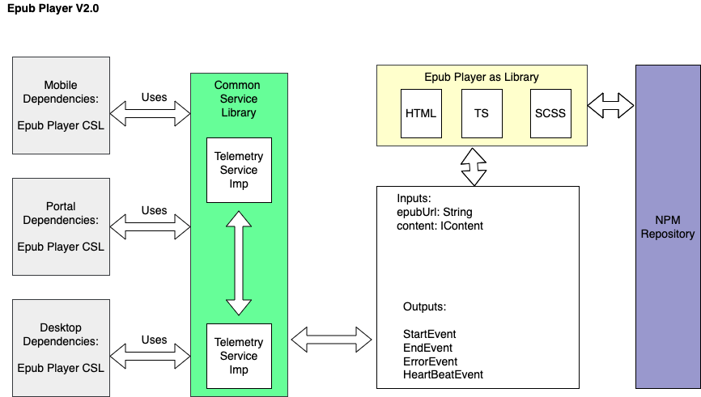

# PDF Player

The [Common Player](../../../learn/docs/content-management/content-player/common-player/) is package with all the content types. So It became bulky & little slow while lauching the content. Hence we split the PDF player as an independent player to improve the performance & load time while launching the content.

### Usecase:&#x20;

[https://project-sunbird.atlassian.net/wiki/spaces/CON/pages/1586561053/PDF+Player+V2](https://project-sunbird.atlassian.net/wiki/spaces/CON/pages/1586561053/PDF+Player+V2)

### Architecture

**Design Document**:

&#x20;[https://project-sunbird.atlassian.net/wiki/spaces/CON/pages/1700102177/PDF+Player+v2.0+Architecture](https://project-sunbird.atlassian.net/wiki/spaces/CON/pages/1700102177/PDF+Player+v2.0+Architecture)

### Git Repo


