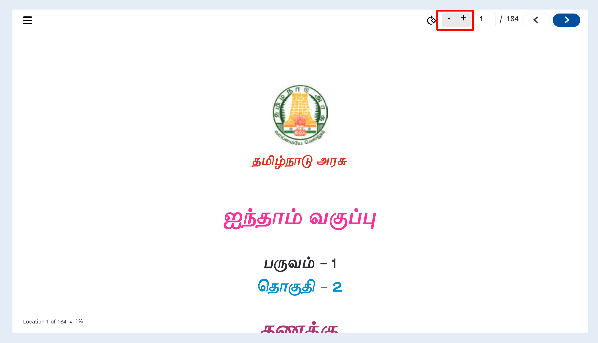
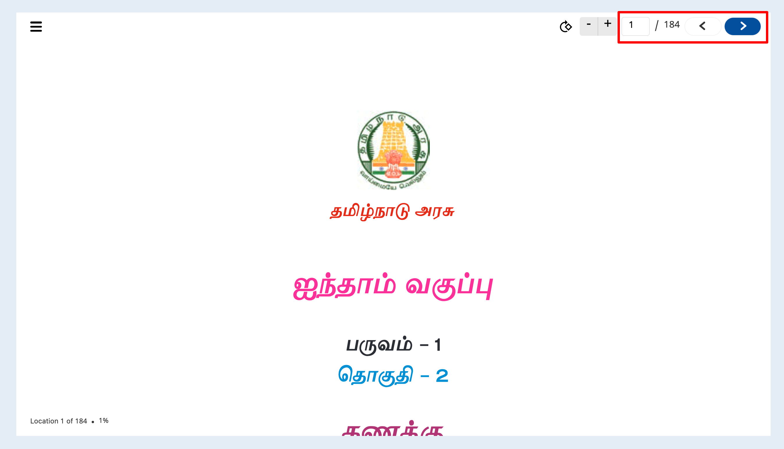
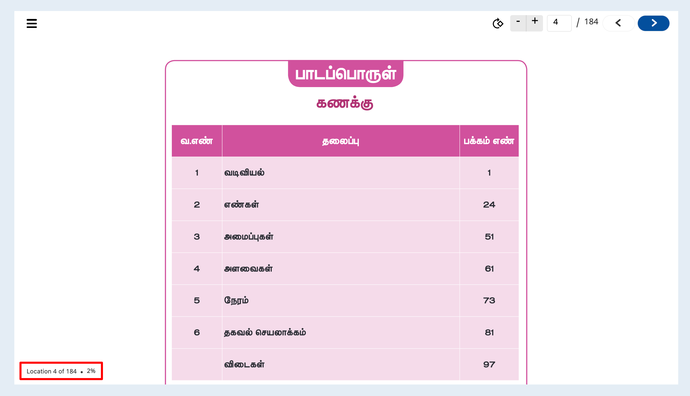

# Features

### Capabilities

1. **Performance**\
   The pdf player has better performance because it is developed independently and its lightweight and easily configurable and easy to implement and use.
2. **Light weight**\
   ****This pdf player is light weight because it developed independently and it's not coupled with any other player so the player is not heavy and performance of the player will be better.
3. **Adaptability** \
   ****This pdf  player has the ability to adapt to changing requirements and also has adaptability  to all screen resolutions like web , portal and desktop applications.
4. **Lazy loading** \
   &#x20;**** This pdf player is built in lazy loading feature so that it will improve the performance of the player and also user experience.
5. **Configurability**\
   &#x20;**** This pdf player can be configured by passing the player config , for example easily show/hide side menu options like download and etc.\
   Sample config link **** : [https://github.com/project-sunbird/sunbird-pdf-player/tree/release-4.8.0#player-config](https://github.com/project-sunbird/sunbird-pdf-player/tree/release-4.8.0#player-config)
6. **Traceability** \
   ****This pdf player has the ability to trace all the events thought telemetry data.

### Features

1.  **Zoom** \
    This zoom feature has the ability to view given pdf content in a much larger and smaller view.\
    \
    sample config to enable is&#x20;

    ```
    "config": {
       "toolBar": { 
        "showZoomButtons": true, // show/hide zoom button in toolbar. default value is false 
       }
    }
    ```
2.  **Rotate**\
    This rotate feature has the ability to rotate given pdf content based on some angle(as of now 90 degree rotation)\
    .png>)\
    \
    sample config to enable is&#x20;

    ```
    "config": {  
    "toolBar": { 
      "showRotateButton": true // show/hide rotate button in toolbar. default value is false
    }
    }
    ```

    }
3.  **Navigate** \
    This navigate feature will provide the user to jump to any number of page in given pdf content and also able view previous and next page from given page\
    \


    sample config to enable is&#x20;

    ```
    "config": {  
      "toolBar": { 
           "showPagesButton": true, // show/hide pages button in toolbar. default value is false
           "showPagingButtons": true, // show/hide paging button in toolbar. default value is false
      }
    }
    ```
4. **Location**\
   This feature will help us to understand current page number..png>)
5. **Progress**\
   This feature will help us to understand how much percentage (%) of content I have read
6.  **Side menu**: \
    This player has the side menu feature like share, download and etc based input config provided.\
    \


    sample config to enable is&#x20;

    ```
    "config": {  
        "sideMenu": { 
          "showShare": true, // show/hide share button in side menu. default value is true
          "showDownload": true, // show/hide download button in side menu. default value is true
          "showExit": false, // show/hide exit button in side menu. default value is false
          "showPrint": true // show/hide print button in side menu. default value is true
        }
    }
    ```

    &#x20;&#x20;
7. **Player events**
   * Start : This event is the beginning of the player event and will be triggered when the player starts.
   * End : This is one of the player event , which will be triggered when the player reaches the end of the content.
   * HeartBeat: The player also has some other events like share, full screen, minimize screen, open menu, close menu, reply.\

8. **Telemetry events**
   * Start Event: This is the start event that will be triggered when the player starts playing.
   * Interact Event: This is the Interact event which will be triggered when the user does any interaction in the player like menu open or share and etc.
   * Impression Event: This is the impression event that will be triggered when we open the player.
   * End event: This is the end event and will be triggered when the player stops playing.
