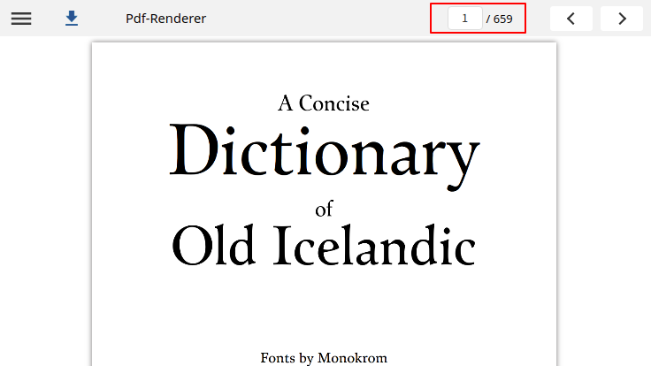
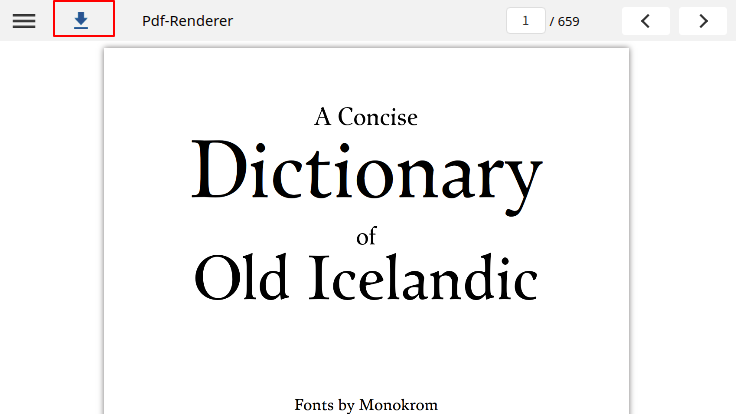

# PDF Player - v1

### Features

1. **Jump to page** \
   This navigate feature will provide the user to jump to any number of page in given pdf content and also able view previous and next page from given page\
   

sample config to enable this next and previous buttons

```
 { 
     "showNext": true, // show/hide next navigation button on content. default is true
     "showPrevious": true, // show/hide previous navigation button on content. default is true
 }

```

**2. Download pdf**

User can download the pdf content by clicking on the download icon


