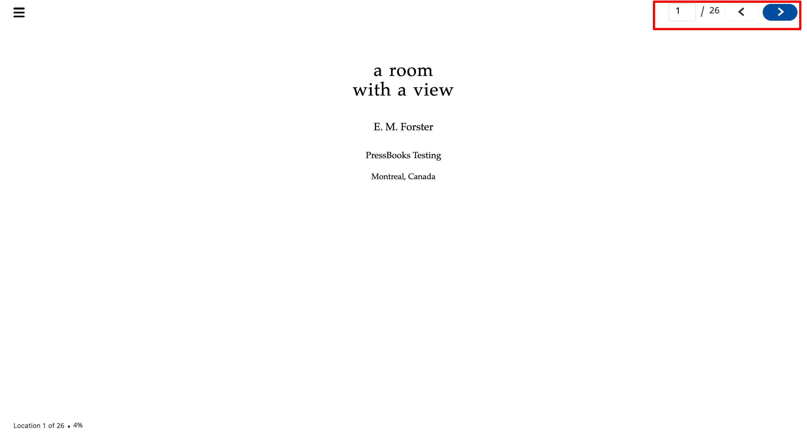
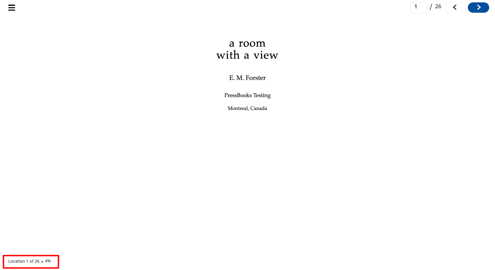
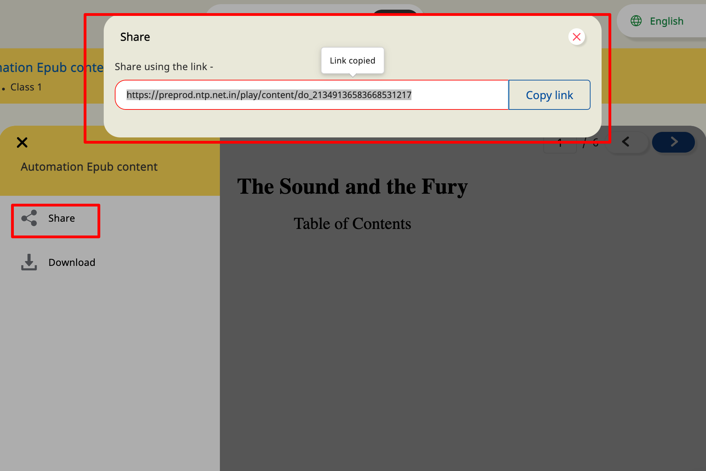
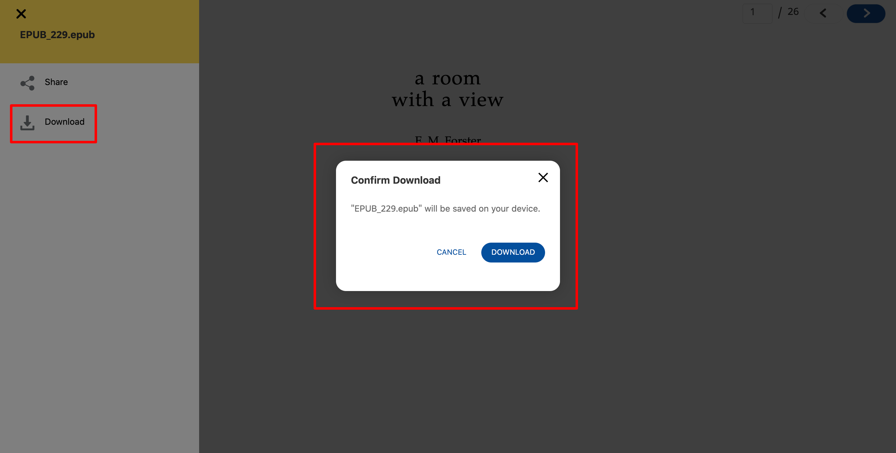

# Features

* **Navigate** \
  ****This navigate feature will provide the user to jump to any number of pages in given pdf content and also be able view previous and next pages from a given page. \
  \
  \

* **Location**\
  ****This feature will help us to understand the current page number.\
  \
  \

* **Progress** \
  ****This feature will help us to understand how much percentage (%) of content I have read.\
  \
  \

* **Side menu** \
  ****This player has the side menu feature like share, download and etc based input config provided.\
  \
  ****\

  *   **Share**: \
      &#x20;This share feature is used to help share content link. and the default value is false.\


      sample config to enable is\
      ****&#x20;

      ```
      "config": { 
          "sideMenu": { 
            "showShare": true, // show/hide share button in side menu. default value is false     
          }
      }
      ```

      \
      \

  *   **Download**\
      ****This download feature helps to download content and the default value is false.\


      sample config to enable is\
      **** &#x20;

      ```
      "config": {
           "sideMenu": {      
            "showDownload": true, // show/hide download button in side menu. default value is false  
          }
      }
      ```

      ****\
      ****\
