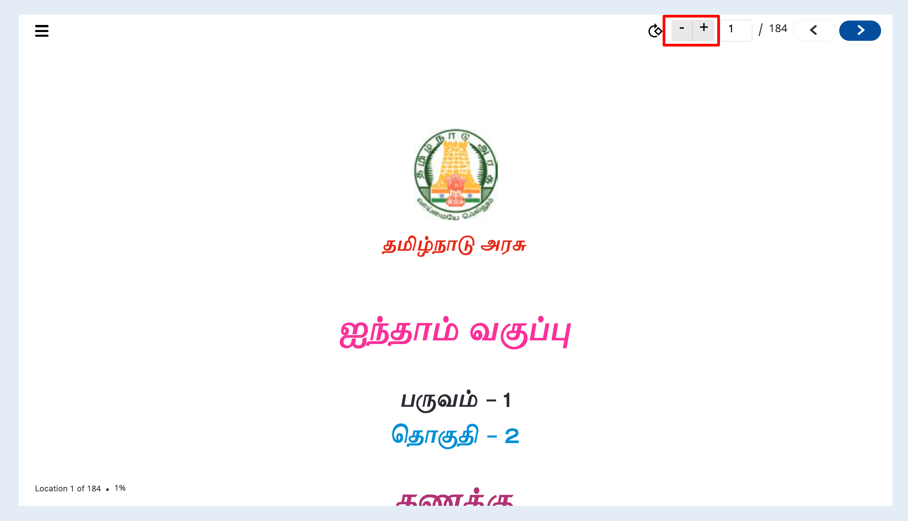
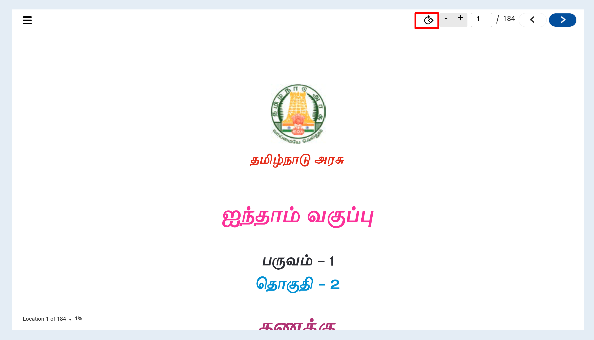
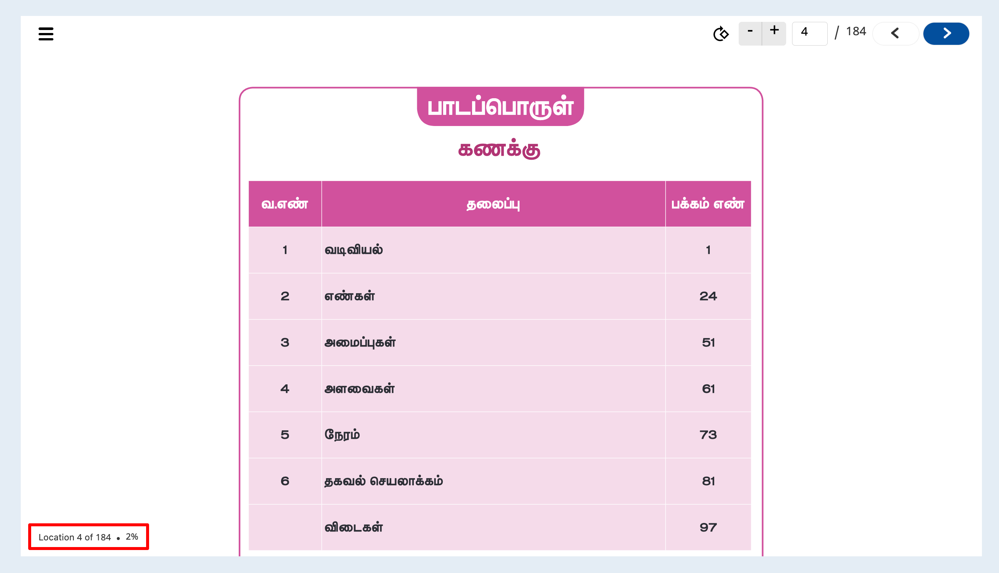
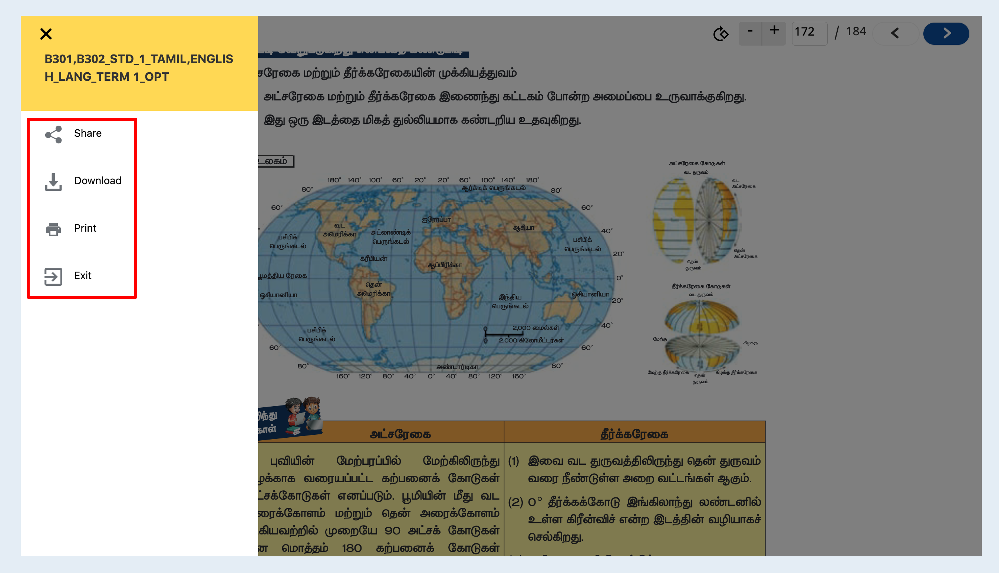

# Features

###

### Features

1.  **Zoom**\
    This zoom feature has the ability to view given pdf content in a much larger and smaller view.\
    \
    sample config to enable is

    ```
    "config": {
       "toolBar": { 
        "showZoomButtons": true, // show/hide zoom button in toolbar. default value is false 
       }
    }
    ```
2.  **Rotate**\
    This rotate feature has the ability to rotate given pdf content based on some angle(as of now 90 degree rotation)\
    \
    \
    sample config to enable is

    ```
    "config": {  
    "toolBar": { 
      "showRotateButton": true // show/hide rotate button in toolbar. default value is false
    }
    }
    ```

    }
3.  **Navigate**\
    This navigate feature will provide the user to jump to any number of page in given pdf content and also able view previous and next page from given page\
    .png>)\\

    sample config to enable is

    ```
    "config": {  
      "toolBar": { 
           "showPagesButton": true, // show/hide pages button in toolbar. default value is false
           "showPagingButtons": true, // show/hide paging button in toolbar. default value is false
      }
    }
    ```
4. **Location**\
   This feature will help us to understand current page number.
5. **Progress**\
   This feature will help us to understand how much percentage (%) of content I have read.png>)
6.  **Side menu**:\
    This player has the side menu feature like share, download and etc based input config provided.\
    \\

    sample config to enable is

    ```
    "config": {  
        "sideMenu": { 
          "showShare": true, // show/hide share button in side menu. default value is true
          "showDownload": true, // show/hide download button in side menu. default value is true
          "showExit": false, // show/hide exit button in side menu. default value is false
          "showPrint": true // show/hide print button in side menu. default value is true
        }
    }
    ```
